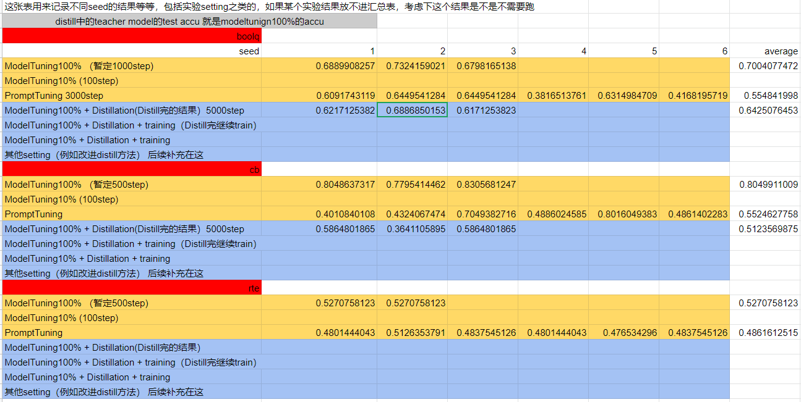
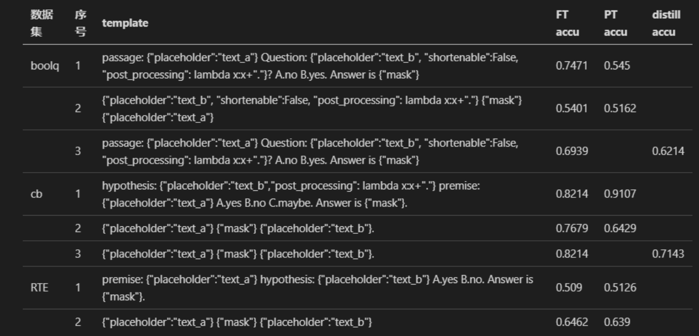

# 实验目的
- 在fewshot设置下, 利用蒸馏的方法提升prompt效果, 或提升训练速度
- 利用fine-tuning过的模型的隐层输出提供更多的监督信号
- 先将模型在fewshot数据集下fine-tuning(ft), 之后固定其参数, 再用另一相同模型进行prompt-tuning(pt). 在pt时, 利用ft输出提供监督信号(如soft_label, attention, 隐层输出), 其中各个loss的比例需要进行调节
- 
# distillation
1. main_copy为主程序，使用`Openprompt`的`PromptForClassification`和`ClassificationRunner`

2. `Distillation_classification_Runner`自定义了runner, 将decoder12~24层的logits与teachermode做对齐, 使用mse loss

3. 程序使用yaml文件控制运行参数, distillation设置下需要传入两个yaml文件(分别对应teacher和student)

# exp
1. main为主程序, 在上面的基础上进行改写, 使用`PromptForGeneration`, 将不同任务统一为生成任务, 参考`Openprompt`.tutorial4.1

# 实验结果
- fine-tuning的weight-decay不宜设置过大, 实验中设为了0
- 不同显卡数量会导致相同seed不同结果
- exp/run_distill(ft/pt).sh 是较优的参数设置, 但仍有探索空间, 比如softprompt个数, warmup step, batch_size, 以及valid频率(实验发现更高的验证频率能带来更好的结果, 同时训练过程中accu变化有些大)
  
- result

- 前期实验结果(distillaion文件夹)

